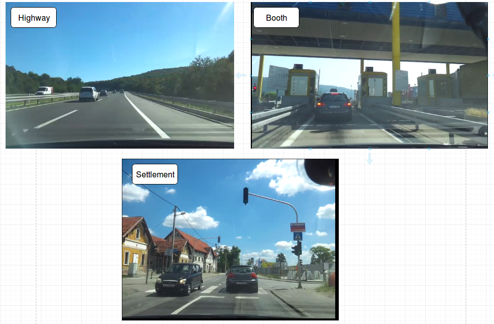

### Classification Types

#### Examples

**High Level Classes**   

**Settlement Classes**   

**Urban**   

**Sub-Urban**   

**Parking**   

**Rural**   

Note : Will be updated based on the input and research. 