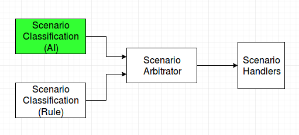

# Scenario Classification using Deep Learning Techniques

### High level Scenario classification using Deep Learning Techniques. 




**Dataset : FM2 Dataset** <br />
FM2 dataset can be downloaded from the [link](http://www.zemris.fer.hr/~ssegvic/datasets/unizg-fer-fm2.zi) <br />

This dataset has below classes. 

```
        a. Highway
	b. Open non-highway road
	c. Tunnel
	d. Tunnel exit
	e. Settlement
	f. Overpass
	g. Booth
	h. Traffic road
```

If you are using the raw dataset downloaded from the above link, you can follow the [README.md](https://gitlab.com/kishor.kumar/scenario_classification_deep_learning/blob/master/Data_Augmentation/README.md) given in the Data_Augmentation director for pre-processing and data augmentationy.

Also the structured dataset (augmented data + the directory structure needed for this project) is available in the FTP site. You can download it from the [link](link).
Note : Currently the Dataset is being copied to FTP site (location - 10.255.30.136/Temp/Behavioral_Planning/Dataset/Scenario_Classification/) - Once copied to FTP, copy the folder to root directory of the project and rename to dataset. <br /> 
Sample weight file upload is also in progress. 

**Directory Structure:** <br />
The folder structure for the training and testing data has been given below: <br /> 

```
|
---- /dataset
|    |
|    ----/training_set
|        |
|        ----/Class_1
|             A1.jpg
|             A2.jpg
|             ...
|        |
|        ----/Class_2
|             B1.jpg
|             B2.jpg
|             ...
|        |
|        ----/Class_3
|             C1.jpg
|             C2.jpg
|             ...
|        |
|        |
|    |
|    ----/test_set
|         |
|         ----/Class_1
|              a1.jpg
|              a2.jpg
|              ...
|         |
|         ----/Class_2
|              b1.jpg
|              b2.jpg
|              ...
|         |
|         ----/Class_3
|              c1.jpg
|              c2.jpg
|              ...
|              ...
```

**Base model used for classification:** **Resnet50**

Sample distribution in the original dataset is as given below <br />
```
highway		4337
road		516
tunnel		601
tunnel exit	64
settlement	464
overpass	86
toll booth	75
traffic		94
```
As the dataset is imabalanced, Data augmentation (adding gaussian noise + rotating the images) has been performed over the existing dataset. And 600 each samples have been selected from the each class  

**Execution Steps :** <br />
### Model Training
1. Update the BATCH_SIZE, NUM_EPOCHS, FC_LAYERS, dropout, FC_LAYERS (if needed) <br />
2. Train the model by running ```python3 resnet_50_v1.py``` <br /> 
3. ```Tensorboard``` can be visualized by running ```tensorboard --logdir=Tensorlog``` from the root directory of the project <br />
4. Weights of the model would be saved in the root directory after each epoch. You can stop the training manually if it leads to overfit. <br />

### Testing on new images
1. Copy the images to be tested in folder ```dataset/raw_image/``` <br />
2. Start the prediction by running ```python3 resnet_50_load_v1.py weight_file_name``` <br />
3. If the weight file is in the root directory edit line number 53 to ```finetune_model.load_weights(pwd+weight_file)``` in ```resnet_50_load_v1.py``` file.
4. This would show the image along with the predicted class.

Note : Model architecture needs to be built first before loading the weights as there is some issue in loading the model directly. 

**Next plan of action:**
1. Move this repository to **Gemini** groups.
2. More dataset is needed to generalize the trained model.
3. The classification types will be updated based on the requirement of proposed Behavioral planning architecture. More details can be found in [Classification_Doc](https://gitlab.com/kishor.kumar/scenario_classification_deep_learning/tree/master/Classification_Doc). 


